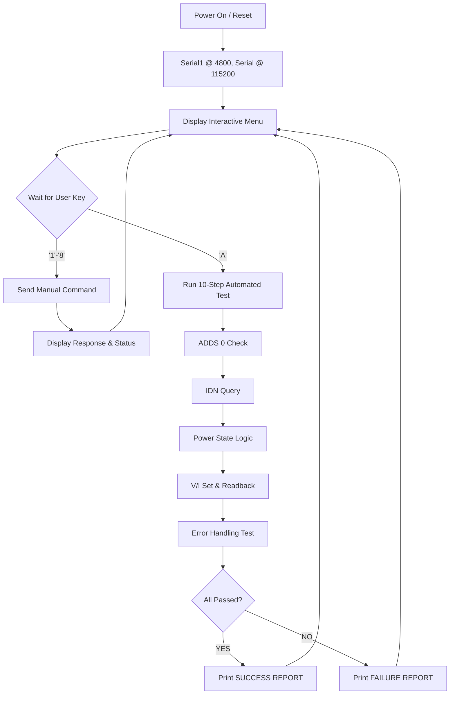

# Comprehensive User Guide: UNICO Master V0.1 - Tester

## 1. Project Overview
The `unico_master_v01.ino` is a robust diagnostic tool developed for the Arduino Uno R4 Minima. It serves as a master controller (Tester) to validate the RS232 communication protocol and operational integrity of the Power Pack Emulator (PPE) or compatible 3kW Power Modules.

### 1.1 Purpose
- **Protocol Verification:** Ensures all commands (ADDS, POWER, SV, etc.) are correctly parsed and responded to.
- **Hardware Integration:** Validates the physical RS232 layer (4800 Baud, 8N1).
- **Automated Stress Testing:** Executes a 10-step sequence to verify edge cases and error handling.

---

## 2. Hardware Setup & Wiring
The tester runs on an **Arduino Uno R4 Minima**. The R4's `Serial1` is hardware-independent from the USB `Serial`, ensuring zero interference during communication.

| Arduino Pin | Signal (RS232) | Connection Target |
| :--- | :--- | :--- |
| Pin 0 (RX1) | RX | TX of Emulator/Power Module |
| Pin 1 (TX1) | TX | RX of Emulator/Power Module |
| GND | Ground | Ground of Emulator/Power Module |
| USB-C | Debug/CLI | PC Terminal (115200 Baud) |

**Note:** If using a real Power Module with ±12V levels, an RS232-to-TTL level shifter (e.g., MAX3232) is **mandatory** to avoid damaging the Arduino.

---

## 3. Software Architecture
The application uses a non-blocking loop with a command-response architecture.

### 3.1 Communication Core (`sendCommand`)
The core function handles:
1. **Buffer Clearing:** Flushes any stale RX data before transmission.
2. **Termination:** Appends `\r\n` to all outgoing strings.
3. **Timeout Logic:** Waits up to 500ms for a response before declaring a `TIMEOUT`.
4. **Validation:** Automatically parses protocol flags (`=>` SUCCESS, `?>` CMD ERROR, `!>` EXEC ERROR).

---

## 4. Operational Guide
### 4.1 CLI Menu
Upon connection at 115200 Baud, the user is presented with:
1. **[Ping] ADDS 0:** Selects the device at address 0.
2. **[Identity] *IDN?:** Queries manufacturer, model, and version.
3. **[Power ON/OFF]:** Toggles the output state.
4. **[Voltage/Current]:** Sets the output targets.
5. **[Automated Full Test]:** The primary validation tool.

### 4.2 Automated Test Sequence Logic
The "Full Test Sequence" (`runFullTest()`) executes the following:
1. **Addressing:** Verifies the device acknowledges its address.
2. **Identity:** Parses the response for the "EMULATOR" keyword.
3. **Power State:** Toggles power and queries `POWER 2` to verify state change.
4. **Range Verification:** Sets 12.5V and expects a readback between 12.0V and 13.0V.
5. **Invalid Command Handling:** Sends a malformed command and expects a `?>` response.

---

## 5. Flowchart (Operational Lifecycle)

---

## 6. Appendices & References
- **Master Requirements:** [master_requirements.txt](../master_requirements.txt)
- **Protocol Protocol Reference:** [emulator_requirements.txt](../emulator_requirements.txt)
- **Source Code:** `unico_master_v01.ino`
